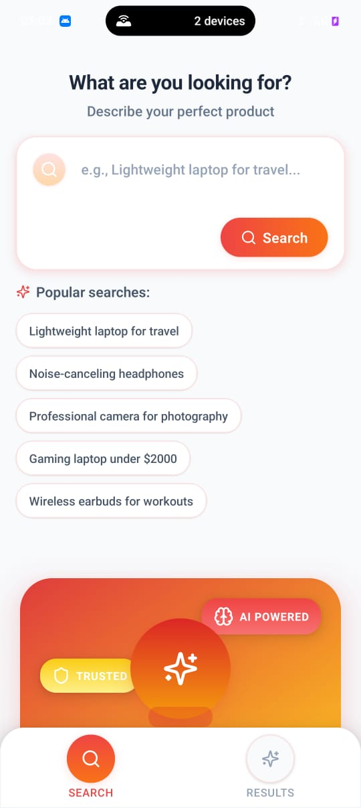
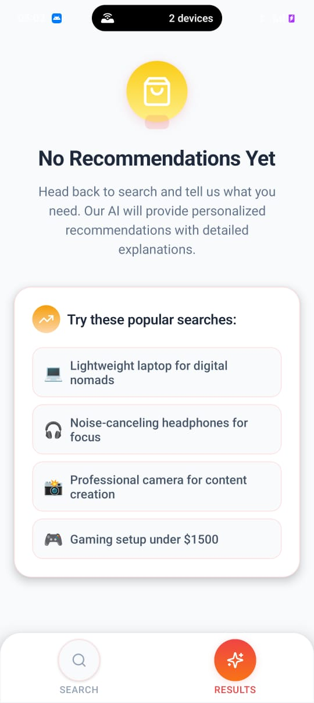
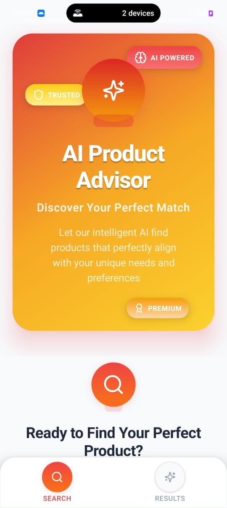

# AI Product Advisor

A React Native application that leverages artificial intelligence to provide personalized product recommendations based on natural language queries.

## 🚀 Features

- **Natural Language Search**: Users can describe their needs in plain English
- **AI-Powered Recommendations**: Integrates with Google Gemini API for intelligent product matching
- **Professional UI/UX**: Clean, modern interface with smooth animations
- **Detailed Product Information**: Comprehensive product cards with specifications and reasoning
- **Real-time Results**: Instant AI analysis with confidence scores and matched features

## 🏗️ Architecture

### High-Level Overview

The application follows a clean, modular architecture with clear separation of concerns:

```
┌─────────────────────────────────────┐
│           Presentation Layer        │
│  ┌─────────────┐  ┌─────────────┐   │
│  │ Search Tab  │  │ Results Tab │   │
│  └─────────────┘  └─────────────┘   │
└─────────────────────────────────────┘
                    │
┌─────────────────────────────────────┐
│           Context Layer             │
│         (State Management)          │
└─────────────────────────────────────┘
                    │
┌─────────────────────────────────────┐
│          Service Layer              │
│  ┌─────────────┐  ┌─────────────┐   │
│  │ AI Service  │  │ Data Layer  │   │
│  └─────────────┘  └─────────────┘   │
└─────────────────────────────────────┘
```

### Component Structure

- **App Context**: Centralized state management for search queries, recommendations, and loading states
- **AI Service**: Handles communication with Google Gemini API and response parsing
- **Product Catalog**: Static data store with product information
- **UI Components**: Reusable components for product display and user interaction

## 📸 Screenshots

### App Flow








### Data Flow

1. User enters natural language query in SearchInput component
2. Query is processed by AIService which constructs an optimized prompt
3. AIService makes API call to Google Gemini with product catalog context
4. AI response is parsed and stored in app context
5. User is navigated to results tab where ProductCard components display recommendations
6. Each recommendation includes confidence score, reasoning, and matched features

## 🎯 Approach

### Key Design Decisions

**1. Context-Based State Management**
- Chose React Context over external libraries for simplicity and direct control
- Enables seamless data sharing between search and results screens
- Maintains state during navigation between tabs

**2. AI Integration Strategy**
- Uses Google Gemini API for natural language understanding
- Constructs detailed prompts that include full product catalog context
- Implements robust error handling and response parsing
- Returns structured JSON responses for consistent UI rendering

**3. User Experience Focus**
- Tab-based navigation for intuitive app flow
- Real-time loading states with animated spinners
- Progressive disclosure of product information
- Clear visual hierarchy with confidence scores and reasoning

**4. Professional UI Design**
- Gradient color system with consistent brand colors
- Smooth animations using react-native-reanimated
- Card-based layouts with subtle shadows and rounded corners
- Typography hierarchy with Inter font family
- Responsive design patterns for different screen sizes

**5. Error Handling**
- Comprehensive error boundaries and user feedback
- Graceful degradation when AI service is unavailable
- Clear error messages with actionable next steps

## 📁 File Structure

```
├── app/
│   ├── _layout.tsx                 # Root layout with context provider
│   ├── +not-found.tsx             # 404 error screen
│   └── (tabs)/
│       ├── _layout.tsx            # Tab navigation configuration
│       ├── index.tsx              # Home screen with search interface
│       └── recommendations.tsx     # Results screen with AI recommendations
├── components/
│   ├── SearchInput.tsx            # Search input component with AI integration
│   ├── ProductCard.tsx            # Product display component with recommendations
│   ├── LoadingSpinner.tsx         # Animated loading component
│   └── EmptyState.tsx             # Empty state components for different scenarios
├── contexts/
│   └── AppContext.tsx             # Global state management
├── data/
│   └── productCatalog.ts          # Product database with TypeScript interfaces
├── services/
│   └── aiService.ts               # Google Gemini API integration
├── hooks/
│   └── useFrameworkReady.ts       # Expo framework initialization hook
├── package.json                   # Dependencies and scripts
├── app.json                       # Expo configuration
└── README.md                      # This documentation
```

### File Organization Principles

**Separation of Concerns**: Each directory has a specific responsibility:
- `app/`: Route-based screens and navigation
- `components/`: Reusable UI components
- `contexts/`: State management and data sharing
- `data/`: Static data and type definitions
- `services/`: External API integrations and business logic

**Single Responsibility**: Each file focuses on one specific functionality
- Components handle only UI rendering and user interaction
- Services manage external API calls and data transformation
- Context provides centralized state without business logic

**TypeScript Integration**: Strong typing throughout the application
- Interface definitions for all data structures
- Type-safe API responses and component props
- Enhanced developer experience with IntelliSense

## 🔧 Technical Implementation

### AI Integration
- **Provider**: Google Gemini 1.5 Flash Latest
- **Prompt Engineering**: Structured prompts with product catalog context
- **Response Parsing**: JSON-based response format for consistent data structure
- **Error Handling**: Comprehensive error management with user feedback

### State Management
- **React Context**: Centralized state management
- **Persistent Data**: Maintains search results during navigation
- **Loading States**: Real-time feedback during AI processing

### UI/UX Features
- **Animations**: Smooth transitions using react-native-reanimated
- **Responsive Design**: Optimized for various screen sizes
- **Accessibility**: Proper color contrast and touch targets
- **Performance**: Optimized rendering with proper component lifecycle

## 🔑 API Configuration

The app uses Google Gemini API for AI recommendations. The API key is configured in the `aiService.ts` file. For production deployment, ensure to:


## 🎨 Design System

### Components
- **Cards**: 16-20px border radius with subtle shadows
- **Buttons**: Gradient backgrounds with proper touch feedback
- **Inputs**: Clean borders with focus states
- **Icons**: Lucide React Native for consistent iconography

## 📱 Platform Support

- **iOS**: Full feature support
- **Android**: Full feature support  
- **Web**: Compatible with responsive design